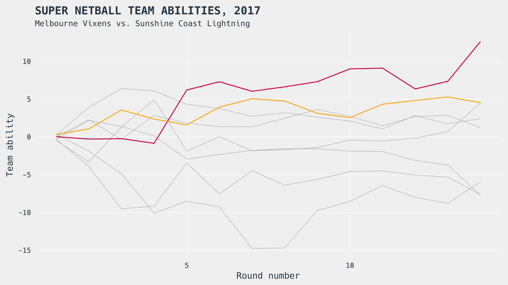
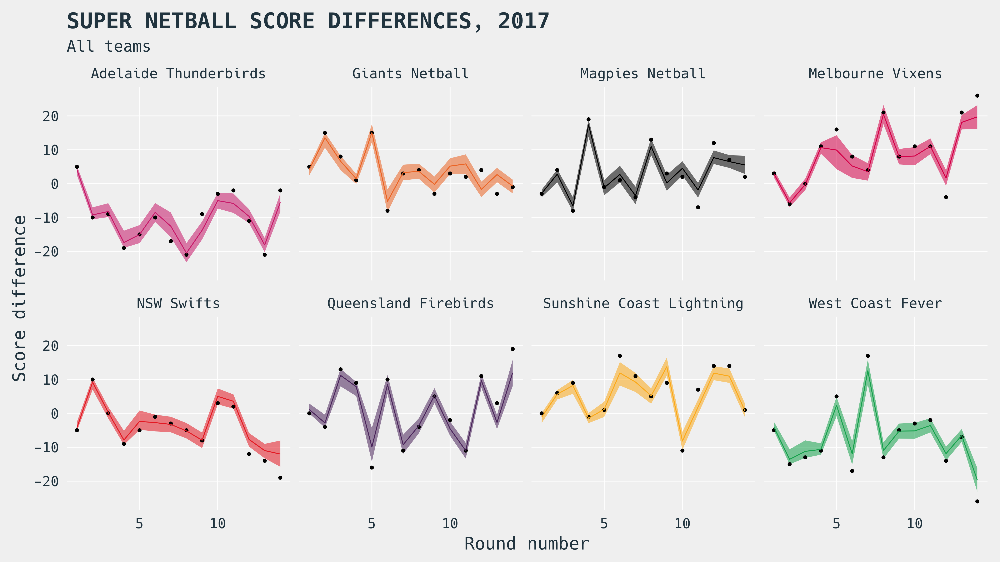
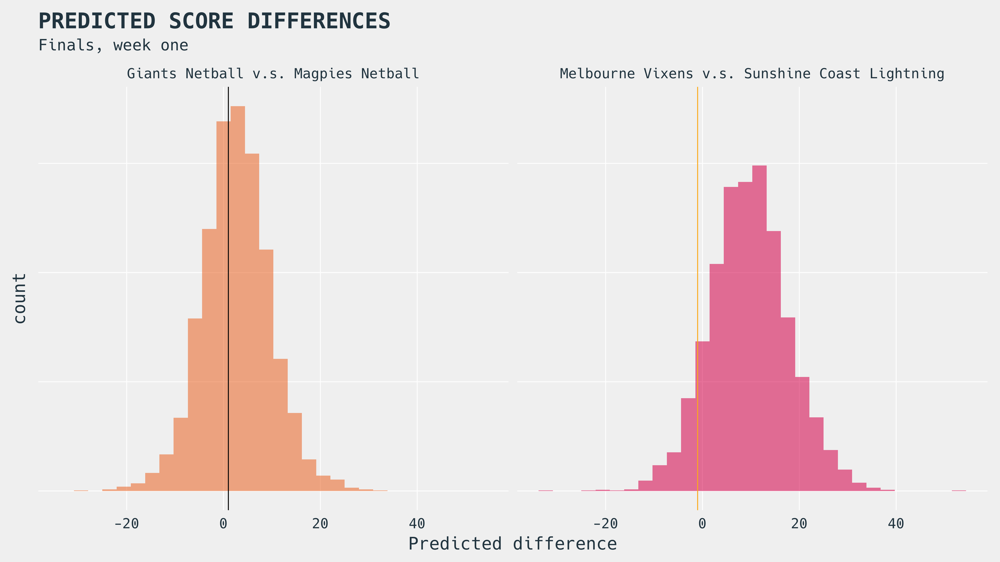

layout: true
class: left, top
background-image: url(img/CEBRALogo-01.svg)
background-size: 215px
background-position: right top

---
class: center, middle
background-image: 


.bigr[[http://cebra.unimelb.edu.au/](http://cebra.unimelb.edu.au/)]

<!-- Time-stamp: <2017-09-04 07:25:42 (slane)> -->

---
class: inverse, center, middle
background-image: 

# Here we go!

```{r,knitr-setup,echo=FALSE,warning=FALSE,message=FALSE,cache=FALSE,results="hide"}
library(dplyr)
knitr::opts_chunk$set(cache = FALSE, error = FALSE, warning = FALSE,
                      message = FALSE, echo = TRUE)
options(digits = 2)

```

---
class: center, middle



.logo-overlay[]

---
class: center, middle



.logo-overlay[]

---
class: center, middle



.logo-overlay[]

---
class: inverse, center, middle
background-image: 

# Enough about netball!

## What about biosecurity?

---
class: top, left

# Janie

<p>
  <br><br><br>
  All views presented within are the author's only, and do not necessarily represent the views of CEBRA.
  <br><br>
</p>
